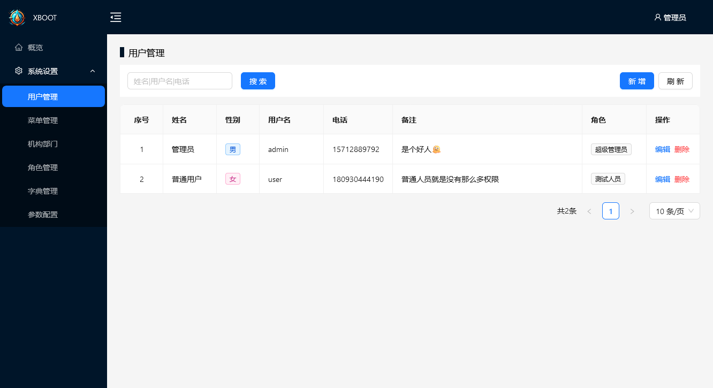
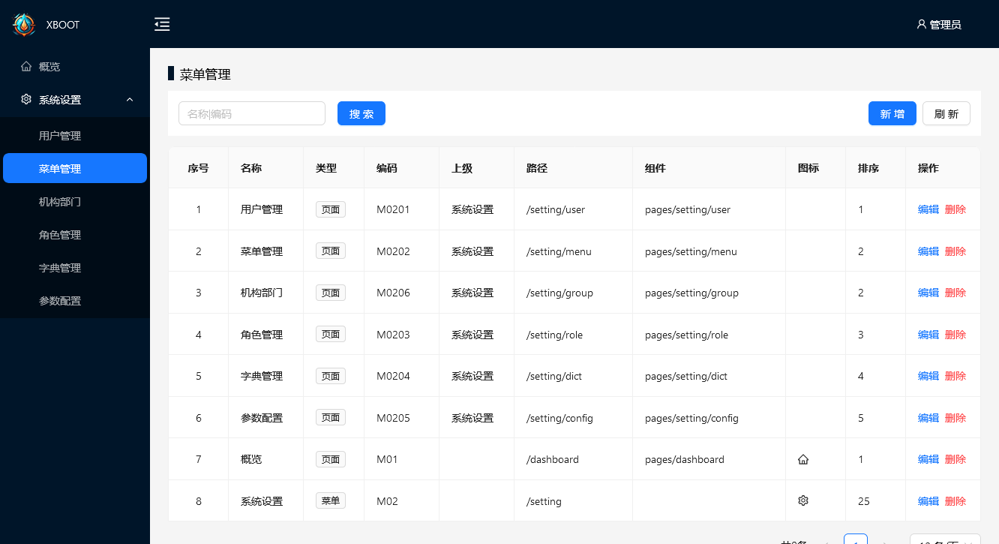
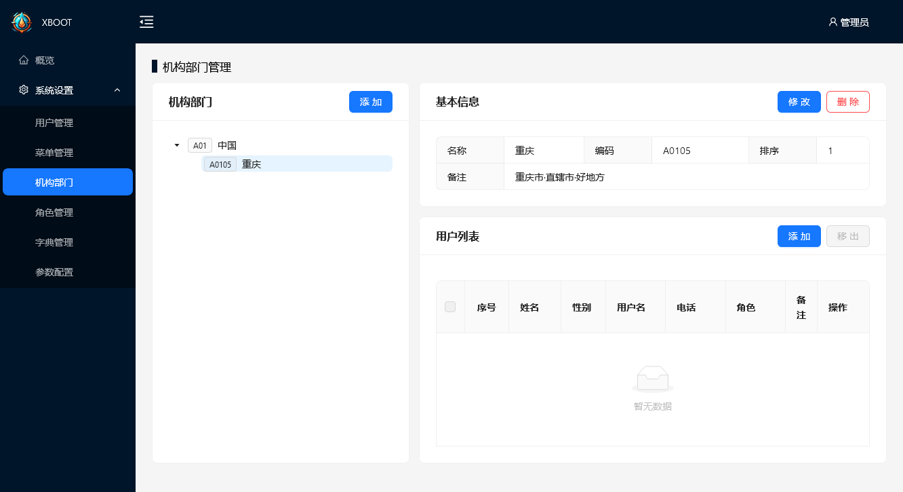

# XBOOT 基于springboot3.x  + vue3.x 的后台管理系统

一套简单的，基于springboot3.x  + vue3.x的后台系统快速开发框架。

在线预览DEMO: [https://boot.x-xi.cn](https://boot.x-xi.cn)

<table>
<tr>
<td></td>
<td></td>
</tr>
<tr>
<td></td>
<td></td>
</tr>
</table>

## 特点

- 简介：只有简单的依赖
- 轻量：只保留核心功能
- 灵活：可以在此系统上灵活的扩展出灵活的业务功能

## 快速部署

使用 docker compose 启动

- [docker-compose.yml](./docker-compose.yml)

```shell
# 进入docker-compose.yml的目录
docker compose up -d
# 访问映射的端口默认：18801
curl -i http://localhost:18801
```

访问地址：[http://localhost:18801](http://localhost:18801)
账号：admin
密码：qwer1234


## 项目组成

- xboot-api 后台API工程
- xboot-web 前端工程


### 后端依赖

```gradel
dependencies {
    implementation 'org.springframework.boot:spring-boot-starter-security'
    implementation 'org.springframework.boot:spring-boot-starter-web'
    implementation 'org.springframework.boot:spring-boot-starter-actuator'
    runtimeOnly 'org.postgresql:postgresql'

    // fix @EnableWebSecurity(debug = true) 引起的问题
    implementation 'org.springframework.security:spring-security-config:6.2.2'

    runtimeOnly 'org.flywaydb:flyway-core:9.22.3' // 这个匹配springboot版本
    implementation 'com.baomidou:mybatis-plus-spring-boot3-starter:3.5.5'
    implementation 'org.redisson:redisson:3.26.0'
    // hutool
    def hutoolVersion = '5.8.25'
    implementation "cn.hutool:hutool-core:${hutoolVersion}"
    implementation "cn.hutool:hutool-crypto:${hutoolVersion}"
    implementation "cn.hutool:hutool-jwt:${hutoolVersion}"
    implementation "cn.hutool:hutool-captcha:${hutoolVersion}"

    compileOnly 'org.projectlombok:lombok'
    annotationProcessor 'org.projectlombok:lombok'

    testImplementation 'org.springframework.boot:spring-boot-starter-test'
    testImplementation 'org.springframework.security:spring-security-test'
}
```

### 前端依赖

```json
{
  "dependencies": {
    "@ant-design/icons-vue": "^7.0.1",
    "ant-design-vue": "^4.1.2",
    "js-md5": "^0.8.3",
    "p5": "^1.9.0",
    "pinia": "^2.1.7",
    "three": "^0.161.0",
    "vanta": "^0.5.24",
    "vue": "^3.3.11",
    "vue-router": "^4.2.5"
  },
}
```